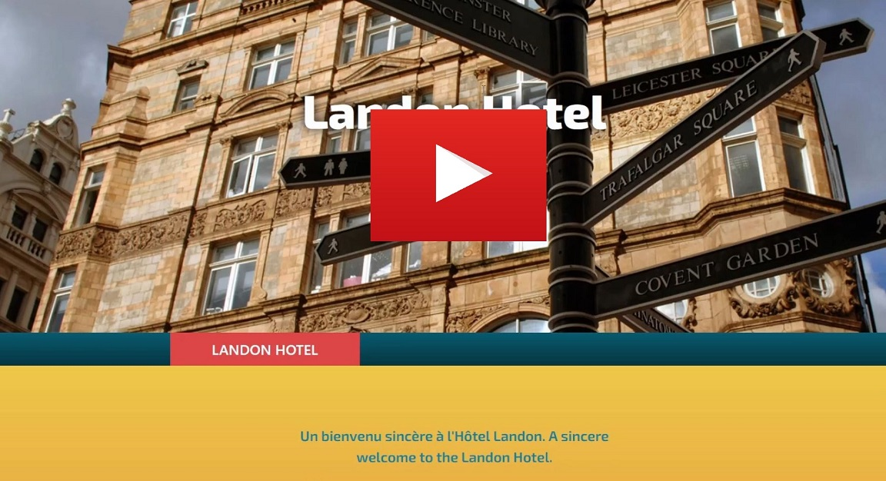

# Reservation System Multithreaded Backend Extensions

## Table of Contents
- [Overview](#overview)
- [Features](#features)
- [How to Run the Application](#how-to-run-the-application)
- [Video Demonstration](#video-demonstration)
- [Credits](#credits)
- [Contact](#contact)

## Overview
This project extends a prebuilt full-stack application (see [Credits](#credits)) to demonstrate several key back-end development concepts. The original system provides core functionality for room reservations, availability viewing, and related features. The added functionalities in this project showcase:

- **Multithreading**: Implementing concurrent processing to handle resource-intensive tasks (e.g., generating welcome messages) without blocking the main application threads.
- **Back-End Integration**: Creating custom RESTful API endpoints with Spring Boot controllers and services, which handle business logic and interact with the database or external systems. These controllers follow REST principles, enabling the front-end to communicate with the back-end via HTTP requests (GET, POST, etc.).
- **Timezone Considerations**: Handling time zone conversions for meeting scheduling, ensuring that the application adjusts to users' local times.
- **Front-End Modifications**: Updating the Angular front-end to support dynamic currency conversions for booking rates based on user preferences.

By implementing these features, this project demonstrates the integration of complex back-end systems, with a modular and clean approach following RESTful principles, while also modifying the front-end to meet specific user requirements.

The application uses:
- **Spring Boot** for the back-end
- **Angular** for the front-end

## Features
The following features were designed and implemented to extend the base functionality:

#### 1. **Meeting Invitation with Time Zone Conversion**
- **Files**:
  - `DateTimeController.java`
  - `DateTimeService.java`
- **Description**:
  - Dynamically generates a meeting invitation displaying the current time in **Eastern**, **Mountain**, and **UTC** time zones.
  - Uses Java's `ZonedDateTime` API to convert and format times appropriately.
  - Provides a REST endpoint (`/api/datetime/results`) to fetch the time-converted message.

#### 2. **Multithreaded Welcome Messages**
- **Files**:
  - `WelcomeMessageController.java`
  - `WelcomeMessageService.java`
  - `welcome_message_en_US.properties`
  - `welcome_message_fr_CA.properties`
- **Description**:
  - Loads and serves welcome messages in English (US) and French (Canada) from `.properties` files.
  - Uses a multithreaded service to read and process localization files asynchronously.
  - Exposes a REST endpoint (`/api/welcome/messages`) to fetch localized messages.

#### 3. **Integration with Angular Front-End**
- **Files**:
  - `app.component.ts`
  - `app.component.html`
- **Description**:
  - Added functionality to fetch and display the meeting invitation and welcome messages in the Angular UI.
  - Modified booking rates to display alternate currencies.

### File Tree (Relevant Sections)
Below are the key files related to the custom features:

```text
src/main/java/edu/wgu/d387_sample_code/controller
    ├── DateTimeController.java
    ├── WelcomeMessageController.java
src/main/java/edu/wgu/d387_sample_code/service
    ├── DateTimeService.java
    ├── WelcomeMessageService.java
src/main/resources
    ├── welcome_message_en_US.properties
    ├── welcome_message_fr_CA.properties
    ├── welcome_message.properties
src/main/UI/src/app
    ├── app.component.ts
    ├── app.component.html
```

## How to Run the Application

### **Prerequisites**
- Java 17+
- Node.js and npm
- Maven

### **Steps**
1. **Back-End Setup**:
   - Navigate to the root directory of the project.
   - Run the Spring Boot application with:
     ```
     mvn spring-boot:run
     ```
   - The back-end server runs on `http://localhost:8080`.

2. **Front-End Setup**:
   - Navigate to `src/main/UI`.
   - Install dependencies with:
     ```
     npm install
     ```
   - Start the Angular development server:
     ```
     ng serve
     ```
   - The front-end runs on `http://localhost:4200`.

3. **Access the Application**:
   - Open `http://localhost:4200` in a browser.
   - Explore the reservation system and custom features.

## Video Demonstration
Check out a narrated demonstration of the project on YouTube:

[](https://youtu.be/aqRJk6JHvFk)

Alternatively, see the following .gif:


## Credits
The prebuilt full-stack application was taken from a template provided by Western Governors University from course D387 - Advanced Java Concepts. Extensions made to the application were for a submitted project. This project has been further modified (e.g., with new code comments and a README) for publishing on GitHub.

## Contact
Logan Drda - logan.drda.cs@gmail.com